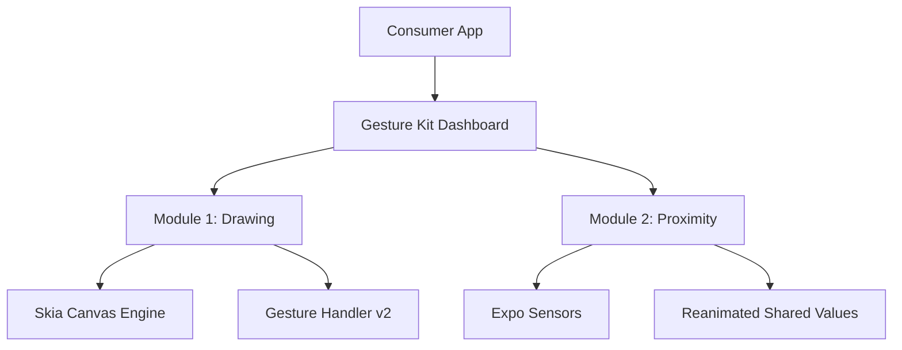

# 🎯 Gesture Kit — Pro Series

> A high-performance, modular interaction suite for React Native & Expo. Built for **60fps - 120fps** performance using Skia, Reanimated 3, and Worklets.

---

## 📦 Core Dependencies

To run this kit at peak performance, ensure the following libraries are installed:

```bash
npx expo install react-native-gesture-handler react-native-reanimated @shopify/react-native-skia expo-sensors expo-blur expo-haptics
```

## 🏗️ Architecture Overview

The kit follows a **UI-Thread First** architecture. All gesture calculations and rendering paths are processed on the native thread through Reanimated Worklets to prevent JS-bridge bottlenecks.



---

## 🎨 1. Advanced Drawing & Signature
Leverages the **Skia 2D Canvas engine** for smooth, vector-based freehand drawing.

### Features:
- **Zero-Latency Pathing:** Real-time Skia path generation using `Gesture.Pan()`.
- **Stylus & Pressure Support:** Type 11 input detection (Stylus/Touch) with variable stroke width based on pressure.
- **Haptic Feedback:** Tactile response on touch start and path completion.
- **Serialization:** Export functionality to PNG or SVG-compatible path data.

---

## 📡 2. Radar Proximity Engine
A sophisticated near-field detection system designed for touchless interactions.

### Features:
- **Sonar Radar UI:** Interactive visual feedback with animated pulse rings.
- **Hybrid Sensor Logic:** Intelligent fallback mechanism for Web/Android/iOS environments using `LightSensor` data.
- **Safe Interaction:** Designed for privacy modes and accidental touch prevention.
- **State Synchronization:** Fully reactive status tracking (NEAR / AWAY).

---

## 🛠️ Project Structure

- `app/index.tsx`: Main Dashboard entry.
- `components/moharm/MoharamDrawing.tsx`: Drawing implementation.
- `components/moharm/MoharamProximity.tsx`: Proximity implementation.
- `components/moharm/MoharamTheme.ts`: Centralized Design System tokens.

## ⚖️ Performance Rules
1. **Always use Worklets:** Never run visual logic on the JS thread.
2. **Minimize State Updates:** Use Shared Values for interaction-heavy components.
3. **Canvas Optimization:** Clear unused SkPath objects to maintain frame rate.

---

© 2026 Moharam Pro Wing. Created for High-Performance React Native Applications.
